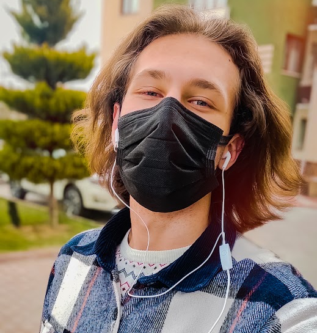

 
<link rel="stylesheet" type="text/css" href="style.css">
 
## Efe Varol Bedelcigil 👋

🔹A self-developing young man who's into cyber security and computer engineering.🔹
  
 

<table class="links">
<tr class="links">
  <td class="links"> 
    
<td class="links"> 
  
  <td class="links"> 
  </tr>
</table>
 

