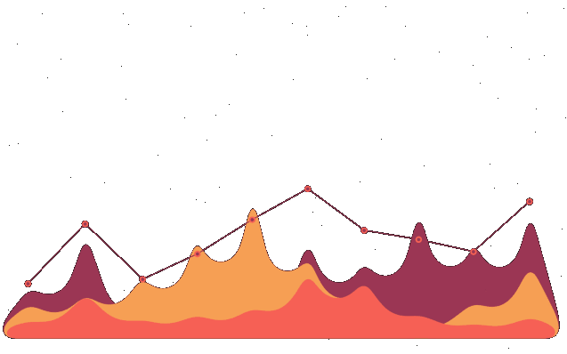

 
 
 <h1> </h1>
 
 
Hi again! I'm a prospective computer engineer and passionate learner. I love taking parts on actions and projects about cyber security. Trying to be up to date, always willing to help people in this realm. Let's not prolong, turn up the volume and start! 

<h2>Socials</h2>

    
  
 
 
    

<h2>   My Tech Stack   
</h2>

   

<h2>Still Learning</h2>

  

<h2> 
   My Github Stats   
</h2> 

        

 

  

 
<h2>
   My Contribution Graph   
</h2>
 

<h2>   Pinned Repos   

</h2>

